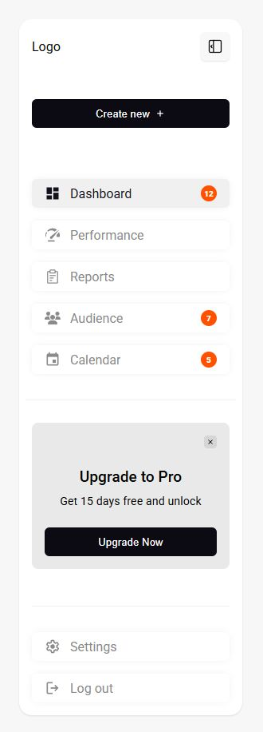

# Sidebar Dashboard UI

Responsive sidebar layout with:

- Collapsible menu
- Badges on menu items
- Dismissible “Upgrade to Pro” card
- Height-aware behavior (hides promo on small screens)

Built with **Vue 3 / Nuxt 3 + SCSS modules**.

---

THIS IS AN OPEN-SOURCE PROJECT

## Demo

👉 [Live demo on GitHub Pages](https://AlexeyLarionov21.github.io/Sidebar/)



---

## Features

- **Collapsible sidebar** – smooth width transition, icon-only mode
- **Menu badges** – with compact marker in collapsed mode
- **Promo card** – closable, remembers state
- **Small-height optimization** – hides promo & separators for <900px height
- **SCSS modules** – isolated styles, media-queries for height

---

## Tech stack

- Vue 3 / Nuxt 3 (Composition API)
- TypeScript
- SCSS modules
- Iconify icons

---

## Getting started

```bash
git clone https://github.com/AlexeyLarionov21/Sidebar.git

cd sidebar

npm install

npm run dev
```
